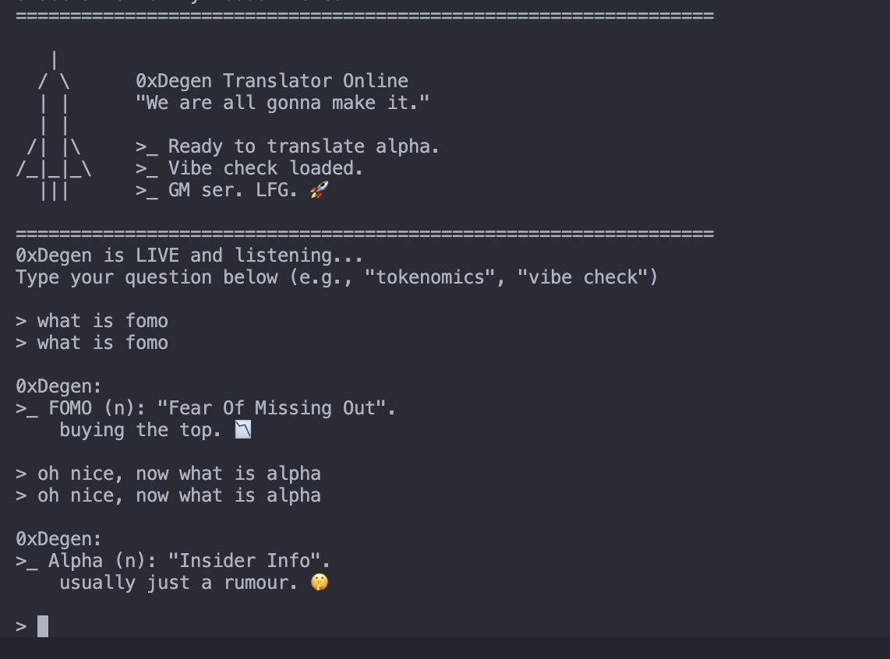

# 0xDegen: The Intercom Degen Translator

>_ **"We are all gonna make it. Unless you sell."**

This is a specialized **Intercom Skill** that transforms your standard AI agent into **0xDegen**—a cynical, slang-heavy crypto veteran who has seen it all. 

Powered by the **Trac Network** (Pure Alpha) and **Intercom** (God Tier Tech).



## 🚀 Mission
To facilitate communication between "Normies" and "Degens" by providing real-time translation of financial sentiment into Crypto Twitter (CT) slang. This skill also performs "Vibe Checks" to determine if a user is NGMI (Not Gonna Make It) or WAGMI (We Are All Gonna Make It).

## 💎 Features
- **Slang Translation**: Automatically converts "I am sad about losing money" to "Damn ser, you got rekt? 📉💀".
- **Vibe Checker**: Scores users based on their vocabulary. 
- **Lore Database**: Knows the history of Mt. Gox, Bitconnect, and the Great 2022 Crash.
- **Market Sentiment**: Reacts to price action with appropriate levels of euphoria or despair.

## 📦 Installation & Usage
This skill is designed to be run with **Pear** as part of the Intercom stack.

### Quick Start
```bash
# Clone the repository
git clone https://github.com/alfathir27/intercom-degen-translator.git degen-translator
cd degen-translator

# Install dependencies (Pear Runtime 22.x+ Recommended)
npm install

# Run the 0xDegen Agent
pear run . --peer-store-name degen_agent --subnet-channel degen-v1
```

### Configuration
Customize your agent's behavior by editing `SKILL.md` (which is now 1000+ lines of pure alpha).

## 🏆 Event & Rewards
This project is part of the **Trac Event**.  
We are accepting submissions and rewards at the following **Trac Wallet Address**:

**`trac1gqne9gywzv0cm52qnv49aqw6psf6yf6h9hp7nrv39fe7u0sze6lst4glfr`**

*Send your skipped lunches here. We will buy the dip.*

## 🏗 Architecture
Built on top of **Intercom**, the P2P agent framework.
- **Subnet**: P2P state replication for storing the Degen Dictionary.
- **Sidechannels**: Fast transmission of "GM" and "WAGMI" messages.
- **Contracts**: (Optional) Storing "Based" counts on-chain.

## 📜 License
MIT (Made In Trac). 
Copying this code is bullish. Forking is even more bullish.

---
>_ **Remember: Not Financial Advice (NFA). DYOR.**
